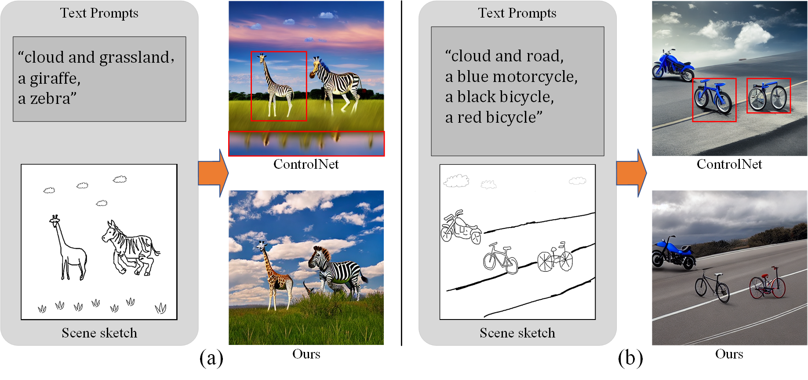
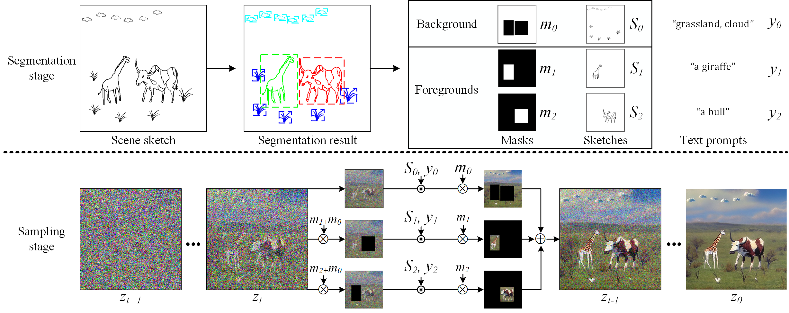
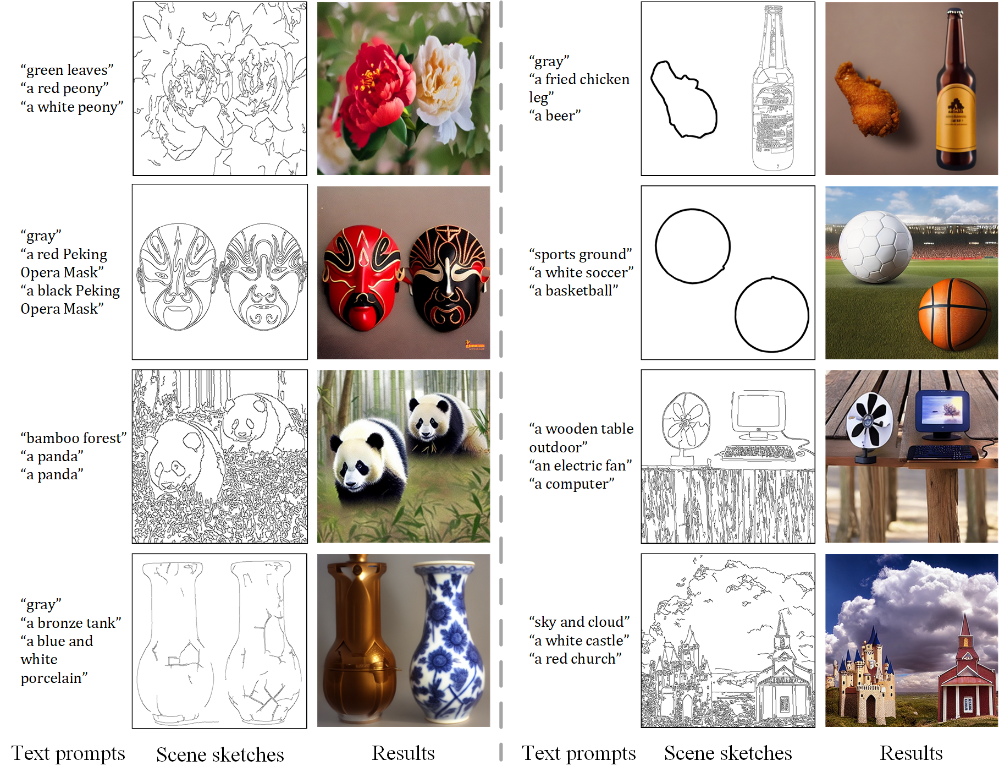

# Multi-Sketch
official pytorch implementation for SCENE SKETCH-TO-IMAGE SYNTHESIS BASED ON MULTI-OBJECT CONTROL, ICASSP2024



# Pipeline



# environment

```
cuda >= 11.3
pytorch >= 1.12.1
torchvision >= 0.13.1
```

# Test

Multi-Sketch is based on [ControlNet](https://github.com/lllyasviel/ControlNet)

### clone codes

```bash
1. git clone https://github.com/sdulily/Multi-Sketch.git
2. git clone https://github.com/lllyasviel/ControlNet.git
3. cp ./Multi-Sketch/sketch_control.py ./ControlNet-main
4. cp -r ./Multi-Sketch/inputs ./ControlNet-main
5. cd ./ControlNet-main
```

### prepare models

1. Download ControlNet scribble weights from [hugging face](https://huggingface.co/lllyasviel/ControlNet/blob/main/models/control_sd15_scribble.pth)
2. put `control_sd15_scribble.pth` to  `./models`
3. run `sketch_control.py`

# Results




# Bibtex

```
@INPROCEEDINGS{10446608,
  author={Cheng, Zhenwei and Wu, Lei and Wang, Changshuo and Meng, Xiangxu},
  booktitle={ICASSP 2024 - 2024 IEEE International Conference on Acoustics, Speech and Signal Processing (ICASSP)}, 
  title={Scene Sketch-to-Image Synthesis Based on Multi-Object Control}, 
  year={2024},
  volume={},
  number={},
  pages={3775-3779},
  keywords={Training;Image segmentation;Noise reduction;Signal processing;Acoustics;Task analysis;Speech processing;Sketch-to-image generation;diffusion models;scene sketches},
  doi={10.1109/ICASSP48485.2024.10446608}}
```


